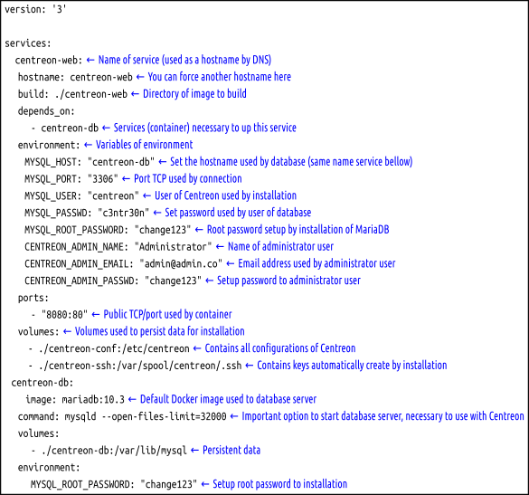

Docker using stable repository
==============================


[](https://asciinema.org/a/fd3IpIoRupeJbhMCH8Q6Op1PK)

Prerequisites:

- Docker-compose: <https://docs.docker.com/compose/>

Docker-compose configuration
----------------------------



Persistent data
---------------

Some directories is necessary to run a minimum persistent data for Centreon

- `/etc/centreon`

This directory contains all configuration files used by Centreon, like as database access

- `/var/spool/centreon/.ssh`

This directory holds the SSH access keys, used for Centreon Central server communication with other remote servers. It is created at environment startup

- `/var/lib/mysql`

This directory contains the data from the Mysql database, managed by the MariaDB image.

Mount point location settings are defined in the docker-compose `Dockerfile` file. These are the minimum mount points to maintain the required data persistence.

How to use
----------

```bash
docker-compose up
```

To always force build of containers, use the command:

```bash
docker-compose up --build
```

For clean all environment:

```bash
docker-compose down -v --rmi local
```
